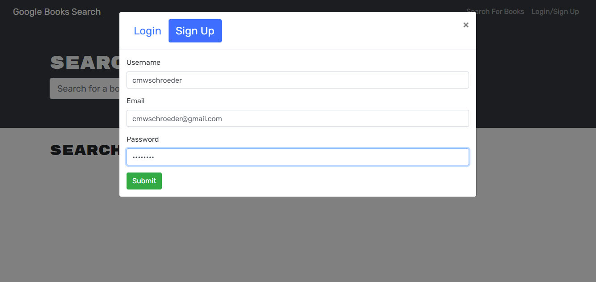
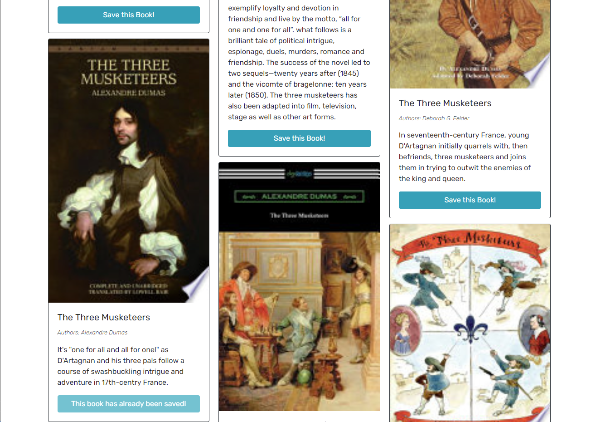
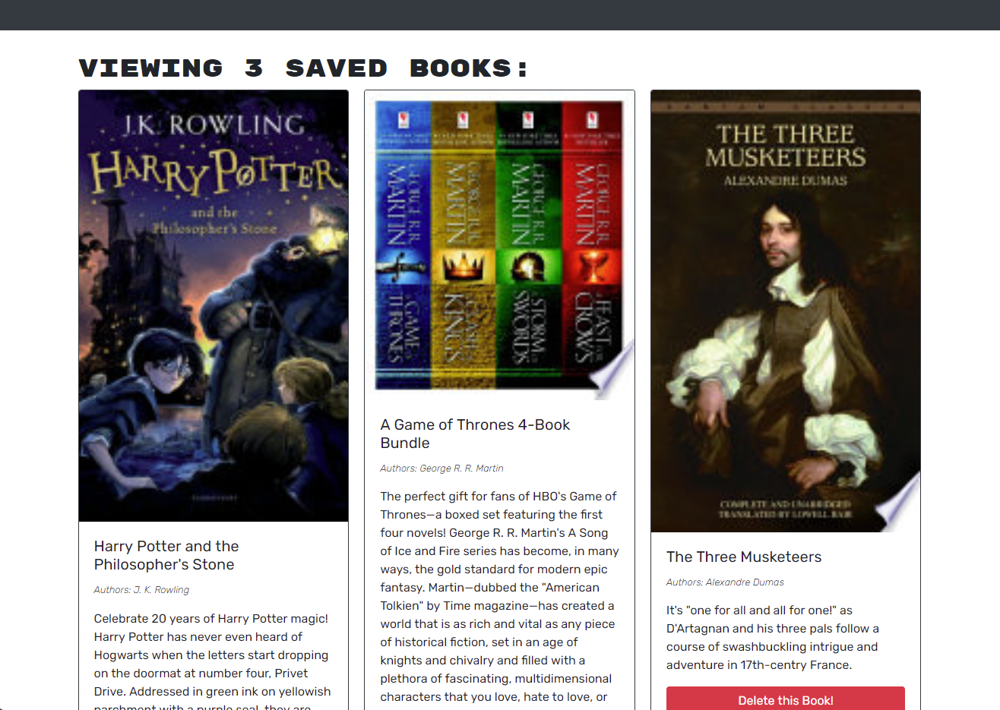
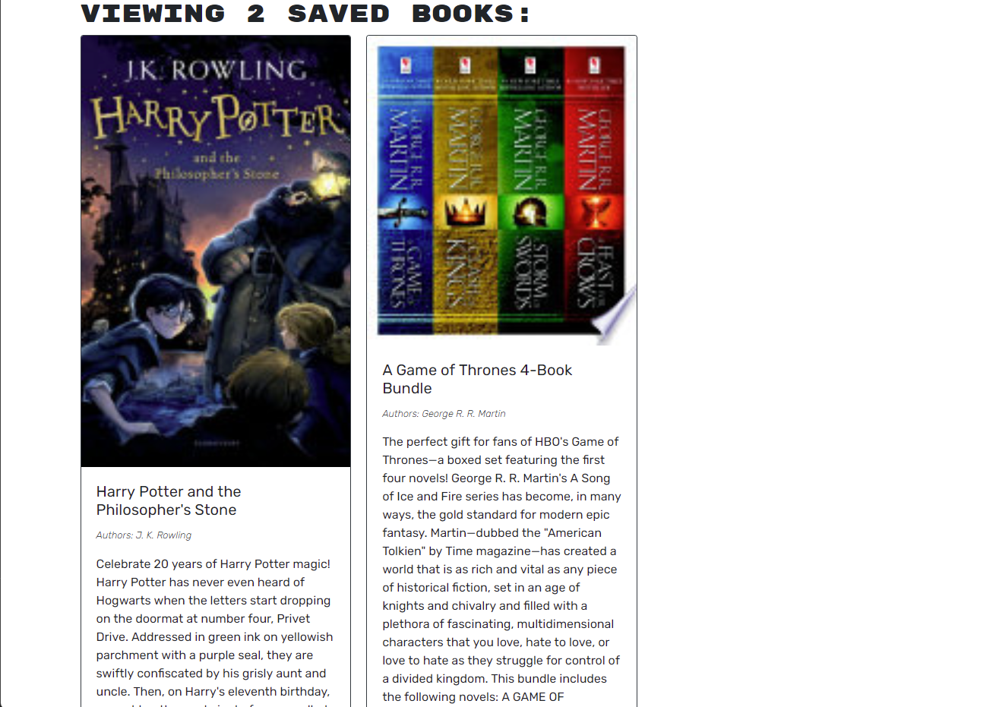

# Book Search Engine

## Description

On this website we use graphql to handle all requests between client side and server side. You can create an account and login through mutations, save and remove books from your account through mutations, and view all your saved book through a query. There is an API request to google books to get their books but everything else is handled in this site. This site utilizes jwt to handle presistent login. Just log in and start searching and saving!

## Table of Contents

* [Technologies](#technologies)
* [Link](#link)
* [Installation](#installation)
* [Usage](#usage)
* [Questions](#questions)
* [License](#license)

## Technologies

| Technology | Link |
| -------- | ------|
| HTML |   |
| Javascript |    |
| React | https://reactjs.org/ |
| graphql | https://graphql.org/ |
| apollo | https://www.apollographql.com/ |
| Node.js | https://nodejs.org/en/ |
| npm | https://www.npmjs.com/ |
| jwt | https://jwt.io/ |
| bcrypt | https://www.npmjs.com/package/bcrypt |

## Installation

If you want to run this project on your local machine just clone the repository and run npm install. From there all you need to do is type npm run develop to launch the server and the client side react site. You will need to have mongoDB running as well since this project uses mongodb to handle CRUD operations.  

## Link

https://sleepy-journey-91001.herokuapp.com/

## Usage

Upon loading the webpage you will have a navbar at the top and a input field for a search on the page. You may type in book titles here into this search field and books will come up that match this text. The webpage uses google books to fill this list of books. Without having logged in all you can see is the books matching your search, so the first step is to log in.  

In order to log in you will need to create an account. Just click on the login/signup on the navbar and click the sign up. Fill out the fields with a username, email and password and you should then be directed back to the search page logged in. Here is an example sign up form:  

  

After logging in you can now search books and add them to your saved book list. Just search up a book and click on the button to save the book. This button will then change to telling you that you have already saved this book. This is what that would look like:  

  

Now we can view our saved books by clicking the "See Your Books" button in the navbar. We will then be directed to a page that has information on all of our saved books. Here is what an example saved books page would look like:  

  

From here the last available option to us is removing books from our saved books list. Just click on the button to delete the book and it will be removed from your list. Here is the same saved book list with one book removed:  

  

At any point you can press the logout button in the navbar and you will be directed back to the search page not logged in. 

## Questions
If you have any questions you can reach me at:  
Github: cmwschroeder  
Github link: https://github.com/cmwschroeder  
Email: cmwschroeder@gmail.com

## License

Licensed under the [MIT License](LICENSE)